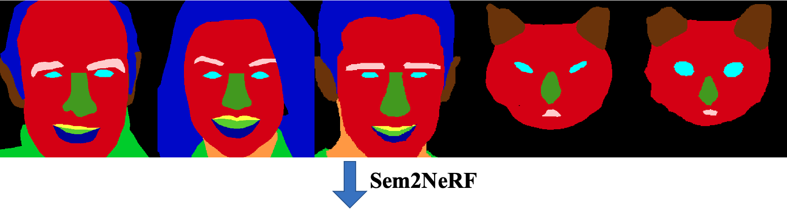

# Sem2NeRF

*Official pytorch implementation of [ECCV'22] Sem2NeRF: Converting Single-View Semantic Masks to Neural Radiance Fields*

<a href="https://arxiv.org/abs/2203.10821"></a>
<a href="https://opensource.org/licenses/MIT"></a>  




[[arXiv Preprint](https://arxiv.org/abs/2203.10821)] 
[[Project Page](https://donydchen.github.io/sem2nerf/)] 
[[Demo Video](https://www.youtube.com/watch?v=cYr3Dz8N_9E)]


## Abstract
Image translation and manipulation have gain increasing attention along with the rapid development of deep generative models. Although existing approaches have brought impressive results, they mainly operated in 2D space. In light of recent advances in NeRF-based 3D-aware generative models, we introduce a new task, **Semantic-to-NeRF translation**, that aims to reconstruct a 3D scene modelled by NeRF, conditioned on one single-view semantic mask as input. To kick-off this novel task, we propose the **Sem2NeRF** framework. In particular, Sem2NeRF addresses the highly challenging task by encoding the semantic mask into the latent code that controls the 3D scene representation of a pretrained decoder. To further improve the accuracy of the mapping, we integrate a new region-aware learning strategy into the design of both the encoder and the decoder. We verify the efficacy of the proposed Sem2NeRF and demonstrate that it outperforms several strong baselines on two benchmark
datasets.


## Recent News

* 11-Jul-2022: released Sem2NeRF codes and models for CelebAMask-HQ and CatMask datasets.
* 22-Mar-2022: initialize the Sem2NeRF repository with demo and arxiv manuscript.


## Getting Started

### Installation

We recommend to use [Anaconda](https://www.anaconda.com) to create the running environment for the project, and all related dependencies are provided in `environment/sem2nerf.yml`, kindly run

```bash
git clone https://github.com/donydchen/sem2nerf.git
cd sem2nerf
conda env create -f environment/sem2nerf.yml
conda activate sem2nerf
```

**Note**: The above environment contains *PyTorch 1.7 with CUDA 11*, if it does not work on your machine, please refer to [environment/README.md](https://github.com/donydchen/sem2nerf/blob/main/environment/README.md) for manual installation and trouble shootings.

### Download Pretrained Weights

Download the pretrained models from [here](https://drive.google.com/drive/folders/15oqMkBunN7jU3qgFTCWbSLZW2rvjheYR), and save them to `pretrained_models/`. Details of files are provided in [pretrained_models/README.md](https://github.com/donydchen/sem2nerf/blob/main/pretrained_models/README.md).

### Quick Test

We have provided some input semantic masks for a quick test, kindly run

```bash
python scripts/inference3d.py --use_merged_labels --exp_dir out/sem2nerf_samples 
```

If the environment is setup correctly, this command should function properly and generate some results in the folder `out/sem2nerf_samples`. For more details regarding datasets, training and more tunning options for inference, kindly walk through the following sections.

------

## Datasets

### CelebAMask-HQ

* Download the [CelebAMask-HQ dataset](https://github.com/switchablenorms/CelebAMask-HQ), and extract it to `data/CelebAMask-HQ/`. The folder should have the following structures

```bash
data/CelebAMask-HQ/
        |--- CelebA-HQ-img/
        |--- CelebAMask-HQ-mask-anno/
        |--- CelebAMask-HQ-pose-anno.txt
        |--- mask_samples/
        |--- test_paths.txt
        |--- train_paths.txt
        |--- val_paths.txt
        |--- vis_paths.txt
```

* Preprocess the semantic mask data

```bash
python scripts/build_celeba_mask.py
```

### CatMask

* Dataset and instructions will be release soon, stay tuned. 


## Inference

### CelebAMask-HQ

Render high quality images and videos. 

```bash
python scripts/inference3d.py \
--exp_dir=out/sem2nerf_celebahq \
--checkpoint_path=pretrained_models/sem2nerf_celebahq_pretrained.pt \
--data_path=data/CelebAMask-HQ/mask \
--infer_paths_conf=data/CelebAMask-HQ/vis_paths.txt \
--test_output_size=512 \
--pigan_infer_ray_step=72 \
--use_merged_labels \
--use_original_pose \
--mask_overlay_weight=0.15 \
--latent_mask=8 \
--inject_code_seed=92 \
--render_videos
```

Use `--render_videos` to render videos with predefined camera trajetory. Change `inject_code_seed` and `latent_mask` to generate multi-modal results, e.g., `--latent_mask=6,7,8 --inject_code_seed=711`. More options and descriptions can be found by running `python scripts/inference3d.py --help`

### CatMask

```bash
python scripts/inference3d.py \
--exp_dir=out/sem2nerf_catmask \
--checkpoint_path=pretrained_models/sem2nerf_catmask_pretrained.pt \
--pigan_curriculum_type=PseudoCats \
--data_path=data/CatMask/mask_samples \
--test_output_size=512 \
--pigan_infer_ray_step=72 \
--use_merged_labels \
--latent_mask=7,8 \
--inject_code_seed=390234 \
--render_videos
```

## Training

### CelebAMask-HQ

We use 8 V100-32G GPUs to train and fine-tune the whole framework for better visual quality. Run the following comand to run the training,

```bash
python -m torch.distributed.launch --nproc_per_node=8 \
scripts/train3d.py \
--exp_dir=out/sem2nerf_celebahq \
--workers=2 \
--batch_size=2 \
--test_output_size=128 \
--train_paths_conf=data/CelebAMask-HQ/train_paths.txt \
--test_paths_conf=data/CelebAMask-HQ/val_paths.txt \
--pigan_steps_conf=configs/pigan_steps/sem2nerf.yaml \
--val_latent_mask=8 \
--train_rand_pose_prob=0.2 \
--use_contour \
--use_merged_labels \
--patch_train \
--start_from_latent_avg
```

If you only have limited GPU resources, e.g., 1 GPU, and still decide to try the training process, you are recommended to set `--nproc_per_node=1 --batch_size=1 --dis_lambda=0.`. If it still does not work, you may consider tuning down the decoder patch size by setting `resolution_vol: 64` in `configs/pigan_steps/sem2nerf.yaml`. Note that this may harm the performance. 

Our framework also supports running without the `torch.distributed.launch` module for easily debugging, kindly start the program as something like `python scripts/train3d.py --exp_dir=out/sem2nerf_celebahq ...`. Besider, it also supports training with *multiple nodes multiple GPUs*, dive into `options/train_options.py` or drop us a message if you need further instructions in this regards.

### CatMask

* Instructions will be released soon.


## Misc

### Citations

If you use this project for your research, please cite our paper.

```bibtex
@article{chen2022sem2nerf,
    title={Sem2NeRF: Converting Single-View Semantic Masks to Neural Radiance Fields},
    author={Chen, Yuedong and Wu, Qianyi and Zheng, Chuanxia and Cham, Tat-Jen and Cai, Jianfei},
    journal={arXiv preprint arXiv:2203.10821},
    year={2022}
}
```

### Pull Request

You are more than welcome to contribute to this project by sending a [pull request](https://docs.github.com/en/pull-requests/collaborating-with-pull-requests/proposing-changes-to-your-work-with-pull-requests/about-pull-requests). 

### Related Work

If you are interested in NeRF / neural representions, we would also like to recommend you to check out another work from our group, [object-compositional implicit neural surfaces](https://qianyiwu.github.io/objectsdf).

### Acknowledgment

Our implementation was mainly inspired by [pixel2style2pixel](https://github.com/eladrich/pixel2style2pixel), we also borrowed many codes from [pi-GAN](https://github.com/marcoamonteiro/pi-GAN), [GRAF](https://github.com/autonomousvision/graf), [GIRAFFE](https://github.com/autonomousvision/giraffe) and [Swin-Transformer](https://github.com/microsoft/Swin-Transformer). Many thanks for all the above mentioned projects.


