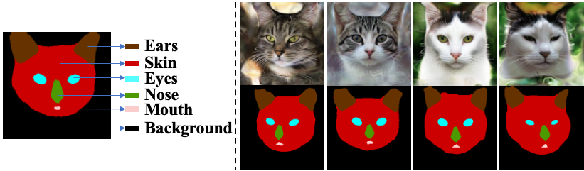

# CatMask Dataset

A pseudo  🐈 😺  dataset rendered with pretrained [pi-GAN](https://github.com/marcoamonteiro/pi-GAN) and labelled with [DatasetGAN](https://github.com/nv-tlabs/datasetGAN_release). 




## Setup

* Download the CatMask dataset from [here](https://drive.google.com/drive/folders/1hpQEMxb-VIz-lvI51ErLvcgujWghLcwr), and 
* [Optional] Verify the downloaded files with md5 checksum.
* Extract them to `data/CatMask/`. The folder should have the following structures

```bash
data/CatMask/
        |__ images/
        |__ mask_samples/
        |__ masks/
        |__ pose-pseudo.txt
        |__ test_paths.txt
        |__ train_paths.txt
        |__ val_paths.txt
```


## Cat Labels

```python
# Original labels  -->  Mapped labels

# Limbus 1    --> 0
# Back 2      --> 0
# Belly 3     --> 0
# Chest 4     --> 0
# Leg 5       --> 0
# Paw 6       --> 0
# Head 7      --> 1
# Ear 8       --> 2
# Eye 9       --> 3
# Mouth 10    --> 4
# Tongue 11   --> 5
# Nose 12     --> 6
# Tail 13     --> 0
# Whiskers 14 --> 7
# Neck 15     --> 0
```
